# SIH 02 — Frontend UX/UI Structure & Backend Integration Architecture

This document provides the full structural analysis of the **SIH 02 Complaint Resolution System** frontend architecture, accompanied by the master **Draw.io (`sih02.io` / `sih02_frontend_ui_ux.drawio`)** system diagram.

---

## 1. Master System Layout & Layer Breakdown

```mermaid
flowchart TB
    subgraph Layer1["Layer 1: Global UI Shell & Foundations"]
        Nav["Global Navbar & Language Switcher"]
        Store["State Stores (Auth, Draft, Tracking, SLA)"]
        Client["API Client & Interceptors (401/429/Offline)"]
    end

    subgraph Layer2["Layer 2: Citizen Portal Flow"]
        Landing["Landing & Hero Track"] --> Auth["OTP Verification"]
        Auth --> Wizard["4-Step Complaint Wizard"]
        Wizard --> AI_Pre["Gemini 2.5 AI Pre-Check"]
        AI_Pre --> Success["Encrypted Submission & Token"]
        Success --> Tracker["Real-Time 6-Stage Tracker"]
        Tracker --> Appeal["PRR Dispute & Feedback"]
    end

    subgraph Layer3["Layer 3: Department Workspace (dep_01..03)"]
        DeptAuth["Officer Login (Argon2id + JWT)"] --> DeptDash["Triage KPI Dashboard"]
        DeptDash --> Queue["Priority & SLA Queue"]
        Queue --> Ticket["Investigation Workspace"]
        Ticket --> SRCS["SRCS Multi-Stage Commit"]
        SRCS --> PRR_Vision["Gemini 2.5 Vision Proof Check"]
    end

    subgraph Layer4["Layer 4: Super Admin & Escalations"]
        AdminDash["Control Tower & Density Heatmap"]
        EscMonitor["Multi-Tier SLA Escalation (24h/36h/72h)"]
        AdminDash --> EscMonitor
        EscMonitor --> StateDBMS["State Gov. DBMS Sync (36h)"]
        EscMonitor --> CentralDBMS["Central Gov. DBMS Sync (72h)"]
    end

    Layer2 -.->|REST API / Bearer| Layer5["Layer 5: Backend API Endpoints & Redis Caching"]
    Layer3 -.->|REST API / JWT| Layer5
    Layer4 -.->|REST API / Audit| Layer5
```

---

## 3. UI/UX Flow & Screen-by-Screen Specification

### A. Citizen (Complainant) Portal
1. **Home / Discovery (`/`)**:
   - Quick action button for instant grievance lodging.
   - Prominent search input for tracking token lookup (`SIH26-MH-DEP01-XXXXX`).
   - Public transparency counter: Live complaints resolved vs. in-progress.
2. **Citizen Authentication (`/auth`)**:
   - Mobile / Email input with 6-digit OTP modal.
   - Resend timer (60s countdown) and guest submission mode.
   - *Backend API*: `POST /api/v1/auth/otp/send` & `POST /api/v1/auth/otp/verify`.
3. **4-Step Complaint Submission Wizard (`/submit`)**:
   - **Step 1 (Category & Text/Voice)**: Department selector (`dep_01`: Infrastructure, `dep_02`: Sanitation, `dep_03`: Utilities), voice recording widget with speech-to-text.
   - **Step 2 (Geo-tagging & Media)**: Auto-detect GPS button, Leaflet/Mapbox pin dropper, multi-file upload with instant thumbnail preview (max 10MB).
   - **Step 3 (AI Instant Pre-Analysis)**: Live call to `POST /api/v1/ai/pre-analyze` powered by **Gemini 2.5 Flash**, displaying extracted urgency score, classified priority badge (Critical/High/Med/Low), estimated SLA resolution window, and duplicate warning if similar issues exist nearby.
   - **Step 4 (Declaration & Encrypted Submit)**: Complainant contact details with optional anonymity toggle, triggering the frontend AES-256 / HMAC salting ingestion barrier via `POST /api/v1/complaints/submit`.
4. **Real-Time Tracking & Verification Timeline (`/track/:token_id`)**:
   - Live SLA remaining countdown clock.
   - Interactive 6-stage vertical stepper:
     1. `Submitted`
     2. `Ingested & Security Check (AES-256 / Salting Verified)`
     3. `Assigned to Department Officer`
     4. `Field Investigation & Action`
     5. `SRCS Stage Resolution Committed`
     6. `Resolved / Re-evaluated`
   - Verified before/after resolution proof images.
   - *Backend API*: `GET /api/v1/complaints/track/{tracking_id}` (Served in sub-milliseconds via Redis cache).
5. **Feedback & PRR Dispute Appeal (`/track/:id/appeal`)**:
   - 1-to-5 star citizen rating and remarks.
   - *"Not Satisfied? Request Re-evaluation"* button that triggers Gemini 2.5 Flash Vision PRR analysis with citizen counter-evidence upload.

---

### B. Department Officer Workspace (`dep_01`, `dep_02`, `dep_03`)
1. **Department Officer Login (`/dept/login`)**:
   - Govt Officer ID, Argon2id-hashed credentials, department selection (`dep_01`, `dep_02`, `dep_03`), and 2FA token.
   - *Backend API*: `POST /api/v1/auth/officer/login` returning scoped JWT + Redis session.
2. **Department Triage Dashboard (`/dept/dashboard`)**:
   - Metric cards: Total Assigned, In Progress, Critical Urgency, Complaints Breaching SLA in < 4 Hours.
   - Department SLA compliance rate chart.
3. **Grievance Queue Ledger (`/dept/queue`)**:
   - Sortable table with dynamic priority colors (Red: Critical / Breached, Amber: < 6h remaining, Green: Normal).
   - Batch assignment to field personnel.
4. **Complaint Detail & SRCS Stage Resolver (`/dept/ticket/:id`)**:
   - **Left Panel**: Citizen summary, geo-coordinates, audio player for original voice recording.
   - **Center Panel**: Gemini 2.5 Flash extracted context, confidence scores, and past history.
   - **Right Panel (SRCS Controls)**:
     - **Stage 1**: Acknowledge & dispatch (`POST /api/v1/srcs/acknowledge`).
     - **Stage 2**: Upload resolution proof photos and officer notes (`POST /api/v1/srcs/submit-proof`).
     - **Stage 3**: Automated Gemini 2.5 Flash Vision proof matching & resolution commit (`POST /api/v1/srcs/commit-resolution`).
5. **Department Transfer Modal (`/dept/reassign`)**:
   - Re-route misdirected complaints to other departments with mandatory audit reason.

---

### C. Super Admin & Escalation Auditor Console
1. **Executive Control Tower (`/admin/overview`)**:
   - System-wide metrics, city/district grievance heatmaps, and NGINX/Redis/Flask system health counters.
2. **Multi-Tier SLA Escalation Monitor (`/admin/escalations`)**:
   - **L0 (24 Hours)**: Departmental breach alerts.
   - **L1 (36 Hours)**: Automatic warehouse escalation table synced to **State Gov. DBMS**.
   - **L2 (72 Hours)**: Automatic warehouse escalation table synced to **Central Gov. DBMS**.
3. **AI Engine & PRR Performance Center (`/admin/ai-engine`)**:
   - Gemini 2.5 Flash classification accuracy matrix, p95 inference latency, and AI threshold tuning controls.
4. **Security & Encryption Barrier Audit Logs (`/admin/audit-logs`)**:
   - Audit trail of AES-256 ingestion, HMAC salting barrier validations, and session token revocations.

---

## 4. Backend Developer API Integration Matrix

| UI Component / Screen | HTTP Method & Endpoint | Request Payload / Params | Response Data & Caching |
| :--- | :--- | :--- | :--- |
| **Citizen OTP Send** | `POST /api/v1/auth/otp/send` | `{ "phone": "+91XXXXXXXXXX" }` | `{ "status": "sent", "session_id": "...", "ttl": 300 }` |
| **Citizen OTP Verify** | `POST /api/v1/auth/otp/verify` | `{ "session_id": "...", "otp": "..." }` | `{ "token": "session_token", "user": { ... } }` |
| **AI Pre-Analysis** | `POST /api/v1/ai/pre-analyze` | `{ "text": "...", "audio_base64": "..." }` | `{ "category": "dep_01", "priority": "CRITICAL", "urgency": 0.94 }` *(Redis cached 1h)* |
| **Submit Complaint** | `POST /api/v1/complaints/submit` | `multipart/form-data` with title, desc, lat, lng, audio, files | `{ "tracking_id": "SIH26-MH-DEP01-XXXXX", "status": "INGESTED" }` |
| **Track Complaint** | `GET /api/v1/complaints/track/:id` | Path param `:id` | Full timeline, officer notes, proofs *(Redis `tracking:<id>` 300s TTL)* |
| **Officer Login** | `POST /api/v1/auth/officer/login` | `{ "username": "...", "password": "...", "dep_id": "dep_01" }` | `{ "token": "jwt_token", "department": "dep_01" }` |
| **Officer Queue** | `GET /api/v1/departments/:dep/complaints`| `?page=1&limit=20&priority=critical` | `{ "total": 142, "items": [ ... ] }` |
| **SRCS Commit** | `POST /api/v1/srcs/commit-resolution`| `{ "complaint_id": "...", "proof_files": [...] }` | Triggers Gemini PRR check, updates `main_db`, invalidates Redis |
| **Escalations List** | `GET /api/v1/admin/escalations` | `?level=state&level=central` | 36h State DBMS & 72h Central DBMS pending sync records |

---

## 5. How to Open and View the Diagram

1. Navigate to [draw.io (diagrams.net)](https://app.diagrams.net).
2. Click **Open Existing Diagram**.
3. Select the file: `C:\Users\HARSHAL\.gemini\antigravity\scratch\sih02_frontend\sih02.io` (or `sih02_frontend_ui_ux.drawio`).
4. You will see the complete 5-layer visual architecture diagram with swimlanes, color-coded status badges, and orthogonal data flow connections.
