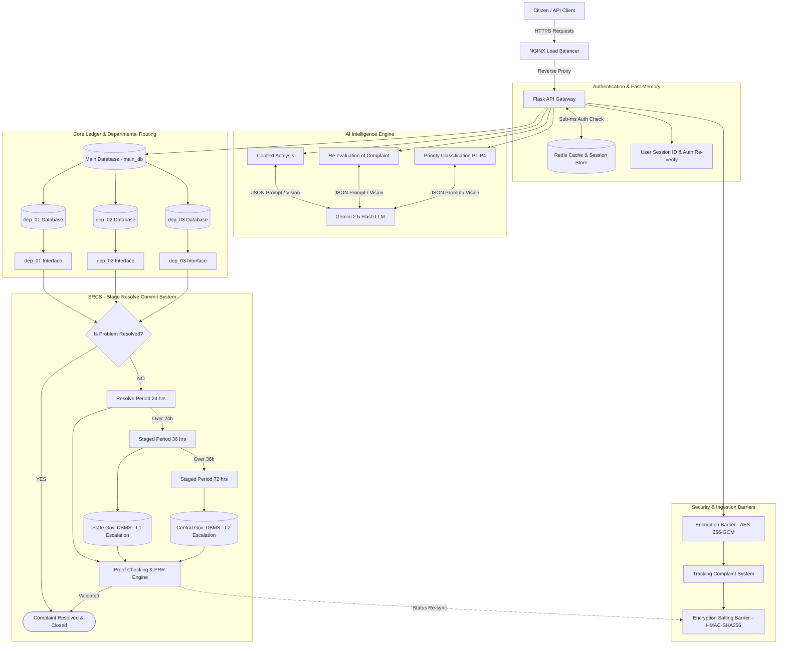

# SIH 02 — Smart India Hackathon Project Repository

Welcome to the official repository for **SIH 02: Complaint Resolution & Tracking System**.

## Project Overview
The **SIH 02 Complaint Resolution System** is an enterprise-grade, AI-driven public grievance and complaint resolution platform built using Python (**Flask**). The system automates grievance intake, performs intelligent context and priority analysis using **Gemini 2.5 Flash LLM**, isolates departmental workflows (`dep_01`, `dep_02`, `dep_03`), and enforces strict resolution timelines through the **SRCS (Stage Resolve Commit System)**.

---

## System Architecture Diagram
The architecture is visually documented, fully compatible with [draw.io](https://app.diagrams.net), and rendered in GitHub Markdown below:

- Master Draw.io Diagram File: [`Sih02.drawio`](Sih02.drawio)



---

## Architectural Components Directory

| Component Name | Technology | Primary Function in SIH 02 |
| :--- | :--- | :--- |
| **NGINX Load Balancer** | NGINX 1.24+ | Reverse proxy, SSL termination, DDoS protection, and load balancing across Flask workers. |
| **User Session & Auth Re-verify** | Flask + Redis | Sub-millisecond session authentication and password/OTP re-verification for critical actions. |
| **Redis Cache & Session Store** | Redis 7.x | In-memory storage for active user sessions, rate-limiting counters, and cached complaint status lookups. |
| **Encryption Barrier** | AES-256-GCM | Encrypts sensitive citizen complaint payloads in transit and at rest. |
| **Tracking Complaint System** | SHA-256 Hash | Generates unique tracking hashes for public citizen status queries. |
| **Encryption Salting Barrier** | HMAC-SHA256 | Adds dynamic secret salts to tracking hashes to prevent hash forgery or unauthorized lookups. |
| **Gemini 2.5 Flash LLM** | Google GenAI SDK | AI engine performing Context Analysis, Priority Classification (`P1-P4`), and PRR Vision Proof Verification. |
| **Main Database (`main_db`)** | PostgreSQL 16+ | Core relational database storing master complaint ledgers, user accounts, and department routing tables. |
| **Departmental DBs (`dep_01..03`)** | Schema-Isolated SQL | Dedicated schema databases for department 01 (Roads), department 02 (Water), and department 03 (Electricity). |
| **Department Interfaces** | Flask Blueprints | Isolated REST API interfaces for departmental officers to process complaints. |
| **SRCS (Stage Resolve Commit System)** | Celery + Flask Engine | SLA escalation engine managing 24h alerts, 36h State Gov. DBMS sync, 72h Central Gov. DBMS sync, and PRR verification. |
| **State Gov. DBMS (L1 Escalation)** | External PostgreSQL | Persistence warehouse for Level 1 SLA breaches (> 36 hours). |
| **Central Gov. DBMS (L2 Escalation)** | External PostgreSQL | Persistence warehouse for Level 2 SLA breaches (> 72 hours). |
| **PRR Engine & Proof Checking** | Gemini 2.5 Flash Vision | Problem Resolve Re-evaluation engine auditing officer-submitted resolution photos before closing complaints. |

---

## Strategy & Specification Documentation Directory (`docs/`)

All prompt engineering and system strategy documents for the Flask backend are stored in the [`docs/`](docs/) directory:

| Document | Description |
| :--- | :--- |
| [**`docs/PRD.md`**](docs/PRD.md) | **Product Requirement Document**: Vision, API endpoints, NFRs, and feature specifications. |
| [**`docs/Architecture.md`**](docs/Architecture.md) | **System Architecture & Tech Stack**: NGINX Load Balancer, Flask App Factory, Redis, Gemini 2.5 Flash, and DB routing. |
| [**`docs/Authentication.md`**](docs/Authentication.md) | **Auth & Session Strategy**: Redis session caching, Argon2id hashing, user re-verification middleware. |
| [**`docs/Security_db.md`**](docs/Security_db.md) | **Database Security & Encryption**: AES-256-GCM Encryption Barrier, HMAC Salting Barrier, and Schema Isolation. |
| [**`docs/Security_audits.md`**](docs/Security_audits.md) | **Security Audits & OWASP**: OWASP Top 10 mitigations, audit trails, and SRCS SLA audit verification rules. |
| [**`docs/Skill.md`**](docs/Skill.md) | **AI Integration & Prompt Engineering**: Gemini 2.5 Flash LLM JSON prompts for context analysis, priority & PRR vision proof matching. |
| [**`docs/Memory.md`**](docs/Memory.md) | **State Management & Memory**: Redis key namespace standards, transient vs persistent memory, and SRCS state machine. |
| [**`docs/Phases.md`**](docs/Phases.md) | **Development Roadmap**: 6-phase implementation Gantt chart from environment setup to production audit. |
| [**`docs/Rules.md`**](docs/Rules.md) | **Coding Guidelines & Blueprint Standards**: Flask coding conventions, safety rules, error handling schemas, and blueprint code templates. |
| [**`docs/README.md`**](docs/README.md) | **Docs Index**: Full strategy guide and environment configuration. |

---

## Quickstart

```bash
# Clone the repository
git clone https://github.com/CSMU-CodeSync/SIH_02-.git
cd SIH_02-

# Set up virtual environment & dependencies
python -m venv venv
source venv/bin/activate  # On Windows: venv\Scripts\activate
pip install -r requirements.txt
```
