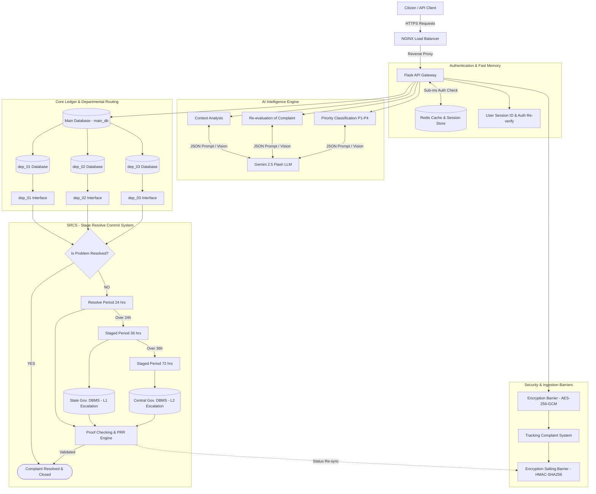

# System Architecture & Tech Stack (Architecture.md) — Flask Backend

## 1. Technology Stack & Component Overview

| Layer | Technology | Specification / Purpose |
| :--- | :--- | :--- |
| **Reverse Proxy & Load Balancer** | NGINX 1.24+ | SSL Termination, DDoS mitigation, rate limiting, and request balancing across Gunicorn workers. |
| **API Gateway Framework** | Python 3.11+ / Flask 3.x | Asynchronous & Blueprint-based REST API framework. |
| **WSGI Server** | Gunicorn (gevent worker model) | Multi-process concurrent request handling. |
| **Cache & Session Store** | Redis 7.x | Sub-millisecond session authentication, rate limiting, and tracking lookup cache. |
| **Security Barriers** | AES-256-GCM & HMAC-SHA256 | Dual-layer Encryption Barrier & Encryption Salting Barrier for payload privacy and tamper-proof hashes. |
| **AI Processing Engine** | Gemini 2.5 Flash LLM (Google GenAI SDK) | Automated context extraction, priority classification (`P1-P4`), and PRR vision proof matching. |
| **Primary Database (main_db)** | PostgreSQL 16+ (SQLAlchemy 2.0 ORM) | Core complaint ledger, user records, and departmental routing index. |
| **Departmental DBs (`dep_01..03`)** | Isolated PostgreSQL Schemas / Databases | Multi-tenant schema isolation for department 01 (Roads), department 02 (Water), and department 03 (Electricity). |
| **SRCS Subsystem** | Celery + Redis Broker | Stage Resolve Commit System managing SLA escalation (24h alert, 36h State DBMS, 72h Central DBMS). |
| **Escalation Data Warehouses** | State & Central Gov. DBMS | External persistence endpoints for L1 (36h) & L2 (72h) SLA breaches. |
| **PRR Engine** | Gemini 2.5 Flash Vision | Problem Resolve Re-evaluation engine auditing officer-submitted resolution proof photos before closure. |

---

## 2. Complete End-to-End System Architecture Topology



---

## 3. Feature-Based Folder Architecture (Flask Modular Structure)

In this architecture, Flask is organized into self-contained **Feature Modules** (`app/features/*`). Each feature owns its routes (Blueprints), data models, services, and schemas:

```
SIH_02/
├── README.md                    # Main Repository Landing Page with Architecture Diagram
├── Sih02.drawio                 # Master Draw.io System Architecture Diagram
├── docs/                        # Architecture & Strategy Prompt Engineering Docs
│   ├── PRD.md
│   ├── Architecture.md
│   ├── Authentication.md
│   ├── Security_db.md
│   ├── Security_audits.md
│   ├── Skill.md
│   ├── Memory.md
│   ├── Phases.md
│   ├── Rules.md
│   └── README.md
├── nginx/
│   └── nginx.conf               # NGINX Load Balancer & Rate Limit Configuration
├── app/
│   ├── __init__.py              # Flask App Factory & Feature Blueprint Registration
│   ├── config.py                # Environment Config (Prod/Dev/Test)
│   ├── extensions.py            # Flask Extensions (SQLAlchemy, Redis, Celery)
│   ├── core/                    # Shared Infrastructure Core Services
│   │   ├── security.py          # Encryption Barrier (AES-256) & Salting Hash (HMAC)
│   │   ├── redis_client.py      # Redis Session Store & Sliding Window Rate Limiter
│   │   └── exceptions.py        # Custom API Exception Handlers
│   └── features/                # FEATURE-BASED MODULES (Domain-Driven Architecture)
│       ├── auth/                # Feature 1: User Session & Re-verification Module
│       │   ├── routes.py        # Auth Blueprint (/api/v1/auth/...)
│       │   ├── models.py        # User & Session Models
│       │   ├── services.py      # Redis Session Store & Password Hashing
│       │   └── schemas.py       # Auth DTO Schemas
│       ├── complaints/          # Feature 2: Ingestion & Encryption Module
│       │   ├── routes.py        # Complaints Blueprint (/api/v1/complaints/...)
│       │   ├── models.py        # main_db Master Complaint Model
│       │   ├── services.py      # Encryption & Tracking Service
│       │   └── schemas.py       # Complaint Ingestion Schemas
│       ├── ai_engine/           # Feature 3: Gemini 2.5 Flash LLM Module
│       │   ├── routes.py        # AI Blueprint (/api/v1/ai/...)
│       │   ├── services.py      # Context Analysis & Priority Classifier Engine
│       │   └── prompts.py       # Structured JSON Prompt Templates
│       ├── departments/         # Feature 4: dep_01, dep_02, dep_03 Isolated Routing Module
│       │   ├── routes.py        # Department Blueprint (/api/v1/departments/...)
│       │   ├── models.py        # dep_01, dep_02, dep_03 Schema Models
│       │   └── services.py      # Department Routing Logic
│       └── srcs/                # Feature 5: Stage Resolve Commit System Module
│           ├── routes.py        # SRCS Blueprint (/api/v1/srcs/...)
│           ├── models.py        # SRCS Audit Ledger Models
│           ├── services.py      # SLA 24h/36h/72h Escalation & PRR Engine
│           └── tasks.py         # Celery Background SLA Workers (State/Central DBMS Sync)
├── requirements.txt             # Python Dependencies
├── Dockerfile                   # Flask App Containerization
├── docker-compose.yml           # Local Orchestration (Flask, Redis, Postgres, NGINX)
└── run.py                       # Application Entry Point
```

---

## 4. Flask WSGI Configuration (`gunicorn.conf.py`)

```python
import multiprocessing

bind = "0.0.0.0:5000"
workers = multiprocessing.cpu_count() * 2 + 1
worker_class = "gevent"
keepalive = 65
timeout = 120
accesslog = "-"
errorlog = "-"
loglevel = "info"
```
