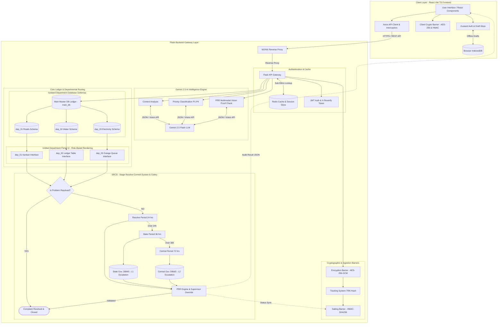

# Architectural Specifications Explained (Architecture_Explained.md)

This document provides a plain-language and technical explanation of every architectural component, term, specification, and design decision in the **SIH 02 Grievance Resolution System**. It is designed so that technical visitors, evaluators, and team members can easily understand how the system works end-to-end.

---

## 1. Master System Architecture & Flow Topology

---

## 2. Plain-Language Dictionary of Architectural Specifications

### A. Core System Concepts

#### 1. SIH 02 System Purpose
The SIH 02 system is an automated, AI-assisted public grievance resolution platform. It allows citizens to submit infrastructure complaints (roads, water, electricity) and ensures government departments resolve them within strict Service Level Agreement (SLA) deadlines.

#### 2. SRCS (Stage Resolve Commit System)
* **What it means**: SRCS is the workflow engine that enforces progress tracking across 4 resolution stages (Acknowledge, Field Dispatch, Proof Submission, and Final Close).
* **Why it matters**: It prevents complaints from getting lost or delayed indefinitely by attaching hard time limits to every stage.

#### 3. PRR (Problem Resolve Re-evaluation)
* **What it means**: PRR is an automated AI audit process that checks whether an officer actually fixed a reported problem.
* **How it works**: When a field officer submits a resolution photo, the system compares it against the citizen's original complaint photo using Google Gemini 2.5 Flash Vision. If the photos do not match or confidence is below 70%, the resolution is blocked until a supervisor manually signs off.

---

### B. Artificial Intelligence & Automation Specifications

#### 1. Gemini 2.5 Flash LLM Integration
* **What it means**: The primary artificial intelligence model used for analyzing text, voice transcriptions, and visual proof photos.
* **Key Tasks**:
  1. **Category Classification**: Automatically routes complaints to Roads (`dep_01`), Water (`dep_02`), or Electricity (`dep_03`).
  2. **Urgency Score**: Assigns a numeric urgency score from 1.0 (trivial) to 10.0 (life-threatening emergency).
  3. **Priority Tagging**: Assigns priority levels from `P1-CRITICAL` (immediate danger) down to `P4-LOW`.
  4. **Visual Proof Audit**: Evaluates before/after photos for physical evidence of resolution.

#### 2. Sub-2.0s Fallback Gate
* **What it means**: A safety threshold built into the backend AI parser. If the AI service takes longer than 2.0 seconds or encounters network latency, the system instantly switches to a fast, rule-based keyword classification parser. This guarantees that complaint filing is never delayed by external API bottlenecks.

---

### C. Security, Privacy & Authentication Specifications

#### 1. AES-256-GCM Client Crypto Barrier
* **What it means**: Military-grade encryption applied directly inside the citizen's browser using the Web Crypto API before data is sent over the internet.
* **Why it matters**: Ensures that sensitive personal details and complaint texts cannot be intercepted or read by unauthorized third parties during transit.

#### 2. HMAC-SHA256 Salting Barrier
* **What it means**: A cryptographic digital signature attached to every complaint payload.
* **Why it matters**: Verifies that the complaint data has not been altered or tampered with after submission.

#### 3. Argon2id Password Hashing & JWT Authentication
* **What it means**: Modern authentication standards for government officers and auditors. Passwords are salted and hashed using Argon2id, and authenticated sessions receive scoped JSON Web Tokens (JWTs) containing explicit role permissions (`OFFICER_DEP01`, `AUDITOR_SRCS`).

#### 4. X-Reverify-Token (Step-Up Authentication)
* **What it means**: A secondary security layer triggered during high-risk operations (such as closing a ticket or transferring a complaint between departments). Officers must re-confirm their identity to generate a short-lived verification token.

---

### D. Data Storage & High-Performance Caching

#### 1. Redis Sub-50ms Cache Layer
* **What it means**: An in-memory data store running alongside the main database.
* **Function**: When citizens look up their complaint status using a tracking code (`TRK-XXXXXXXXXXXX`), Redis serves the response in under 50 milliseconds (`X-Cache: HIT`) without stressing the main database.

#### 2. PostgreSQL `main_db` & Isolated Department Schemas
* **What it means**: The primary relational database system storing all historical complaints, user records, and audit logs.
* **Department Isolation**: Data for `dep_01` (Roads), `dep_02` (Water), and `dep_03` (Electricity) are strictly separated into distinct database schemas. Officers in one department cannot view or alter records belonging to another department.

#### 3. IndexedDB Browser Offline Storage
* **What it means**: A local database built into the citizen's web browser.
* **Function**: If internet connection drops while filing a complaint, the form draft is saved in IndexedDB. When connection returns, the application prompts the citizen to resume their draft without losing typing or uploaded photos.

---

### E. Service Level Agreement (SLA) Escalation Engine

#### 1. 24-Hour Normal SLA
* The initial resolution window assigned to the local department upon complaint ingestion.

#### 2. 36-Hour L1 State DBMS Escalation
* If a complaint remains unresolved past 24 hours, background Celery workers automatically escalate it at the 36-hour mark, logging an audit trail to the **State Government DBMS**.

#### 3. 72-Hour L2 Central DBMS Escalation
* If a complaint reaches 72 hours without resolution, it escalates to the highest level, creating an emergency audit entry in the **Central Government DBMS** and alerting the Super Admin Control Tower.

---

### F. Frontend Resilience & Error Interceptors

#### 1. 401 Session Freeze Interceptor
* If an officer's session expires mid-work, the system freezes all current form inputs in memory, opens a Re-Authentication Modal, and automatically re-executes the pending action upon successful login.

#### 2. 429 Rate Limit Exponential Backoff
* If server traffic spikes and triggers rate limiting, the client displays a *"System busy, retrying..."* notification and automatically pauses for progressive intervals ($1\text{s} \to 2\text{s} \to 4\text{s}$) before retrying.

#### 3. PRR Supervisor Manual Override
* If AI proof validation flags a visual discrepancy (confidence $< 70\%$), ticket closure is blocked until an authorized supervisor attaches a manual digital override signature.

---

## 3. Summary of Technology Stack

| Layer | Technology | Primary Function |
| :--- | :--- | :--- |
| **Frontend Framework** | React 18, Vite, TypeScript | Single-page user interface |
| **UI Components** | Tailwind CSS, Radix UI, Lucide Icons | Responsive, accessible UI components |
| **Client State** | Zustand, TanStack Query | Session state & server API caching |
| **Client Storage** | IndexedDB, Web Crypto API | Offline storage & AES-256 client encryption |
| **Data Visuals** | Recharts, Leaflet / React-Leaflet | Analytics dashboards & geographic heatmaps |
| **API Gateway** | NGINX, Python Flask 3.x | Reverse proxy, rate limiting, and REST endpoints |
| **Fast Memory Cache** | Redis | Session store & sub-50ms tracking cache |
| **Main Database** | PostgreSQL (`main_db`) | Master ledger & isolated department schemas |
| **Artificial Intelligence**| Google Gemini 2.5 Flash API | Multimodal context analysis & PRR vision audit |
| **Background Scheduler** | Celery + Redis Broker | Automated 24h / 36h / 72h SLA escalation jobs |
