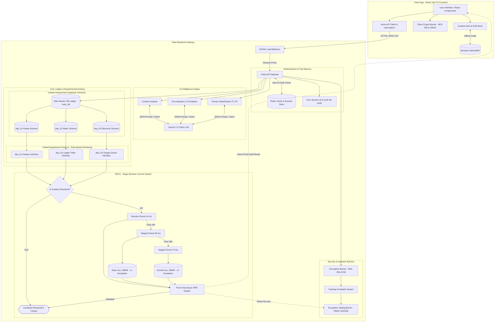
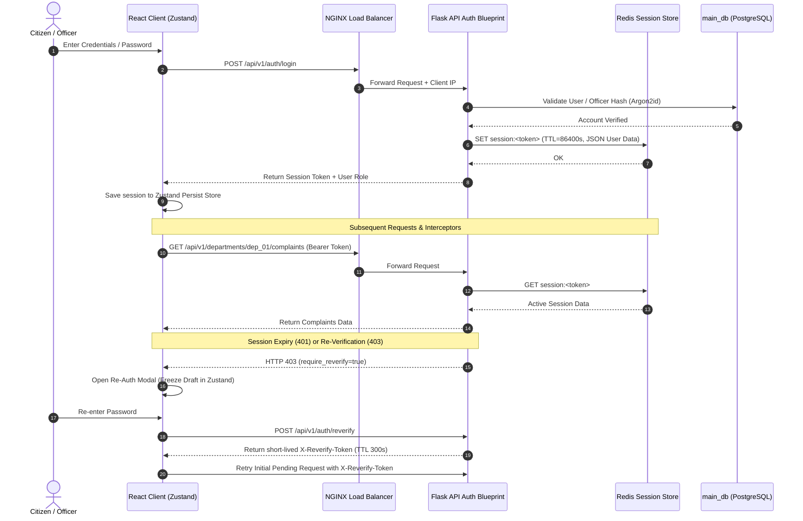

# Authentication Strategy & Session Protocols (Authentication.md) — Full-Stack

## 1. Executive Overview
This document defines the authentication architecture, token lifecycle, and session caching strategy for the **SIH 02 Complaint Resolution System**. 

Identity management uses a hybrid model combining **Redis-backed session tokens** for citizen tracking and **JWT (JSON Web Tokens) with Argon2id password hashing** for departmental officers (`dep_01`, `dep_02`, `dep_03`). On the frontend client, session state is managed via **Zustand with persistence** and **Axios Interceptors**.

---

## 2. Authentication Context in System Architecture

Authentication operates directly between React Frontend, NGINX, Flask API, Redis, and User Re-verification modules as shown in the system architecture topology:

---

## 3. Authentication Flow Sequence & Frontend Interceptors

---

## 4. Frontend Error Recovery Matrix (`AUTH_scenerioes.md` Integration)

| Scenario ID | Trigger Condition | Interceptor / Handling Mechanism | UI State & Action | Final Resolution |
| :--- | :--- | :--- | :--- | :--- |
| **Scenario 1** | Form Submission (Network OK) | Direct API Call (`POST`) | Displays **Step Progress Spinner** | `201 Created` -> Token saved to `LocalStorage` -> Redirects to `/submit/success` |
| **Scenario 2** | Session Expired | UI Interceptor (`401 Unauthorized`) | Freezes form state in `DraftStore` & opens **Re-Auth Modal** | Auto-retries pending API call upon successful authentication |
| **Scenario 3** | High Traffic | Rate Limiter (`429 Rate Limit`) | Displays *'System busy, retrying...'* Toast | Executes Exponential Backoff (1s, 2s, 4s) to retry request seamlessly |
| **Scenario 4** | Connection Loss | Network Status Listener | Switches to **Offline Indicator** & saves draft to `IndexedDB` | Prompts citizen *'Resume previous complaint?'* when back online |
| **Scenario 5** | PRR Vision Mismatch | Automated Confidence Gate (<70%) | Flags *'AI detected proof discrepancy'* on Officer UI | Requires **Officer Supervisor Manual Override Signature** to proceed |

---

## 5. Security & Token Lifecycle Protocols

| Parameter | Specification | Purpose |
| :--- | :--- | :--- |
| **Password Hashing** | `Argon2id` (memory_cost=65536, time_cost=3, parallelism=4) | Protection against GPU/ASIC password cracking. |
| **Session Token Format** | Cryptographically secure 256-bit random hex string | Opaque token immune to signature forgery. |
| **Redis Session TTL** | 24 Hours (86,400 seconds) | Automatic session invalidation. |
| **Re-verification TTL** | 5 Minutes (300 seconds) | Limits window for critical SRCS state changes. |
| **Rate Limiting** | 60 requests/min per IP via Redis Sliding Window | Prevents brute force and API flooding at NGINX & Flask layer. |
