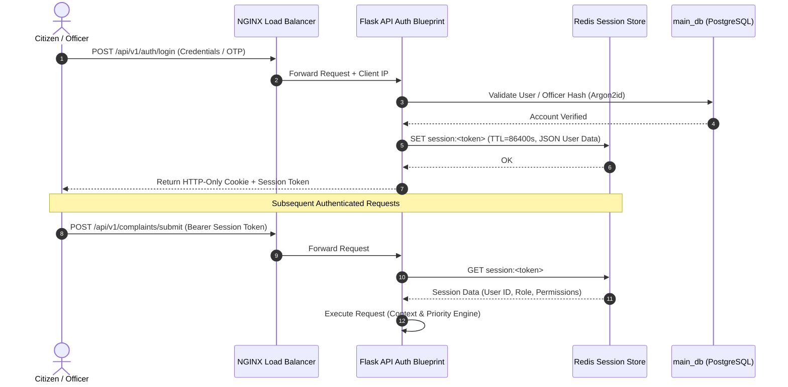

# Authentication Strategy & Session Protocols (Authentication.md) — Flask Backend

## 1. Executive Overview
This document defines the authentication architecture, token lifecycle, and session caching strategy for the **SIH 02 Complaint Resolution System**. 

Identity management uses a hybrid model combining **Redis-backed session tokens** for citizen tracking and **JWT (JSON Web Tokens) with Argon2id password hashing** for departmental officers (`dep_01`, `dep_02`, `dep_03`).

---

## 2. Authentication Flow Topology



---

## 3. Flask Authentication & Re-verification Middleware

### 3.1 Session Verification Decorator (`app/api/auth.py`)

```python
import functools
import json
from flask import request, jsonify, g
from app.extensions import redis_client

def require_session(f):
    @functools.wraps(f)
    def decorated(*args, **kwargs):
        auth_header = request.headers.get("Authorization")
        if not auth_header or not auth_header.startswith("Bearer "):
            return jsonify({"error": "Unauthorized", "message": "Missing authentication token"}), 401
        
        token = auth_header.split(" ")[1]
        session_key = f"session:{token}"
        
        # Check Redis Cache (sub-millisecond response)
        session_data_raw = redis_client.get(session_key)
        if not session_data_raw:
            return jsonify({"error": "Unauthorized", "message": "Session expired or invalid"}), 401
        
        # Load user context into Flask request global `g`
        g.current_user = json.loads(session_data_raw)
        return f(*args, **kwargs)
    return decorated
```

---

## 4. User Re-Verification for Sensitive Actions

When a citizen or departmental officer performs high-sensitivity actions (e.g. submitting resolution proof, triggering SRCS re-evaluation, or altering department parameters), the system requires **User Authentication Re-verify**:

```python
@auth_bp.route("/reverify", methods=["POST"])
@require_session
def reverify_user():
    """Re-authenticates active user password/OTP before critical SRCS state change."""
    data = request.get_json()
    password = data.get("password")
    user_id = g.current_user["user_id"]

    user = User.query.get(user_id)
    if not user or not user.verify_password(password):
        return jsonify({"success": False, "message": "Re-verification failed"}), 403

    # Generate short-lived re-auth token in Redis (Valid for 5 minutes)
    reverify_token = generate_secure_token()
    redis_client.setex(f"reverify:{user_id}", 300, reverify_token)

    return jsonify({"success": True, "reverify_token": reverify_token}), 200
```

---

## 5. Security & Token Lifecycle Protocols

| Parameter | Specification | Purpose |
| :--- | :--- | :--- |
| **Password Hashing** | `Argon2id` (memory_cost=65536, time_cost=3, parallelism=4) | State-of-the-art protection against GPU/ASIC cracking |
| **Session Token Format** | Cryptographically secure 256-bit random hex string | Opaque token prevented from signature forgery |
| **Redis Session TTL** | 24 Hours (86,400 seconds) | Automatic session invalidation |
| **Re-verification TTL** | 5 Minutes (300 seconds) | Limits window for critical state changes |
| **Rate Limiting** | 60 requests/min per IP via Redis Sliding Window | Prevents brute force and API flooding |
