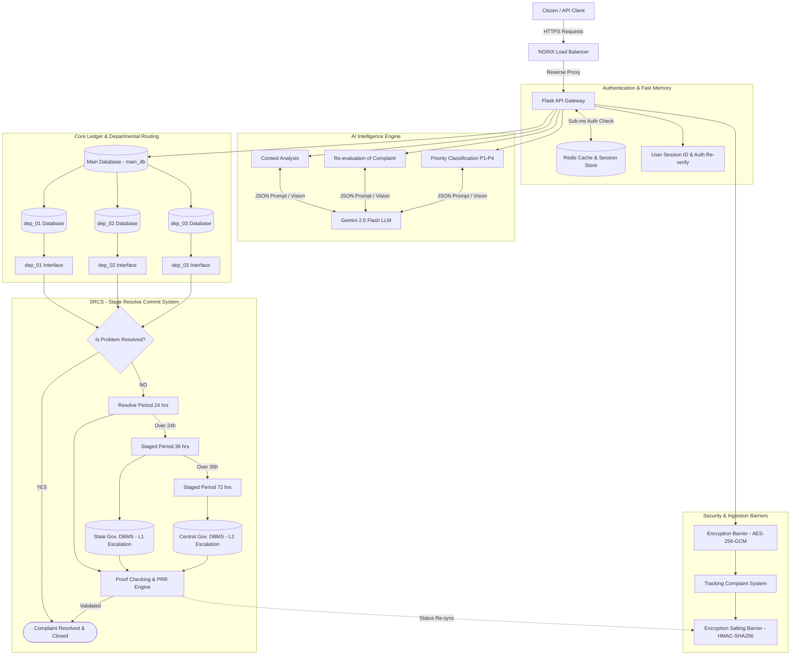

# AI System Memory & State Management (Memory.md) — Flask Backend

## 1. Executive Summary
This document specifies the state tracking protocols, memory persistence schema, and Redis key namespace standards for the **SIH 02 Complaint Resolution System**.

System memory is partitioned into two distinct tiers:
1. **Transient Session Memory (Redis In-Memory)**: Sub-millisecond lookup cache for active sessions, user contexts, and tracking lookups.
2. **Persistent SRCS Audit Memory (PostgreSQL / main_db)**: Long-term immutable ledger of complaint state transitions, SLA breaches, and escalation events.

---

## 2. Memory & State Distribution Topology

Transient Redis memory and persistent SQL memory operate across the system architecture as shown:



---

## 3. Redis Key Namespace Architecture

| Key Pattern | Data Type | TTL | Description |
| :--- | :--- | :--- | :--- |
| `session:<token>` | JSON Hash | 86,400s (24h) | Citizen / Officer authenticated session data. |
| `reverify:<user_id>` | String | 300s (5m) | Short-lived re-authentication token for critical actions. |
| `trk:<hash>` | JSON Hash | 3,600s (1h) | Cached complaint tracking status for high-speed lookups. |
| `rate:<ip>` | Sorted Set | 60s | Sliding window rate limiting request counter. |
| `srcs:active_sla` | Set | Infinite | Set of unresolved complaint UUIDs currently monitored for SLA 24h/36h/72h. |

---

## 4. SRCS State Machine & Lifecycle Matrix


---

## 5. State Persistence Protocol (`app/services/redis_service.py`)

```python
import json
from app.extensions import redis_client

class MemoryStateService:
    @staticmethod
    def cache_complaint_status(tracking_hash: str, complaint_data: dict, ttl: int = 3600):
        """Caches complaint status in Redis for sub-millisecond citizen tracking."""
        key = f"trk:{tracking_hash}"
        redis_client.setex(key, ttl, json.dumps(complaint_data))

    @staticmethod
    def get_cached_status(tracking_hash: str) -> dict:
        """Retrieves cached complaint status."""
        key = f"trk:{tracking_hash}"
        raw = redis_client.get(key)
        return json.loads(raw) if raw else None

    @staticmethod
    def invalidate_cache(tracking_hash: str):
        """Invalidates cache upon status update or PRR resolution."""
        key = f"trk:{tracking_hash}"
        redis_client.delete(key)
```
