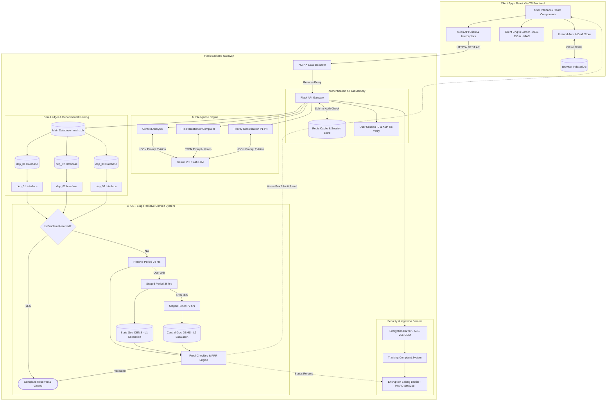
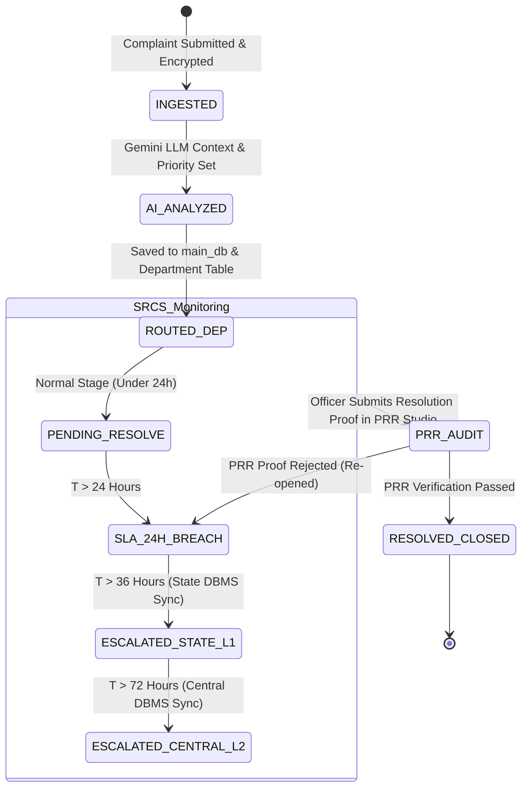

# AI System Memory & State Management (Memory.md) — Full-Stack

## 1. Executive Summary
This document specifies the state tracking protocols, memory persistence schema, client store management, and Redis key namespace standards for the **SIH 02 Complaint Resolution System**.

System memory is partitioned into three distinct tiers:
1. **Client Transient Memory (Zustand + IndexedDB)**: Persistent client session state and offline complaint draft storage.
2. **Server Fast Memory (Redis In-Memory)**: Sub-millisecond lookup cache for active sessions, user contexts, and tracking lookups.
3. **Persistent SRCS Audit Memory (PostgreSQL / main_db)**: Long-term immutable ledger of complaint state transitions, SLA breaches, and escalation events.

---

## 2. Memory & State Distribution Topology

Transient client memory, server Redis memory, and persistent SQL memory operate across the system architecture as shown:



---

## 3. Client State Store (`src/store/authStore.ts`) & IndexedDB

```typescript
import { create } from 'zustand';
import { persist } from 'zustand/middleware';

export const useAuthStore = create()(
  persist(
    (set) => ({
      session: null,
      isReverifyModalOpen: false,
      setSession: (session) => set({ session }),
      openReverifyModal: () => set({ isReverifyModalOpen: true }),
      closeReverifyModal: () => set({ isReverifyModalOpen: false }),
      logout: () => set({ session: null }),
    }),
    { name: 'sih02_auth_store' }
  )
);
```

---

## 4. Redis Key Namespace Architecture

| Key Pattern | Data Type | TTL | Description |
| :--- | :--- | :--- | :--- |
| `session:<token>` | JSON Hash | 86,400s (24h) | Citizen / Officer authenticated session data. |
| `reverify:<user_id>` | String | 300s (5m) | Short-lived re-authentication token for critical actions. |
| `trk:<hash>` | JSON Hash | 3,600s (1h) | Cached complaint tracking status for high-speed lookups. |
| `rate:<ip>` | Sorted Set | 60s | Sliding window rate limiting request counter. |
| `srcs:active_sla` | Set | Infinite | Set of unresolved complaint UUIDs currently monitored for SLA 24h/36h/72h. |

---

## 5. SRCS State Machine & Lifecycle Matrix


