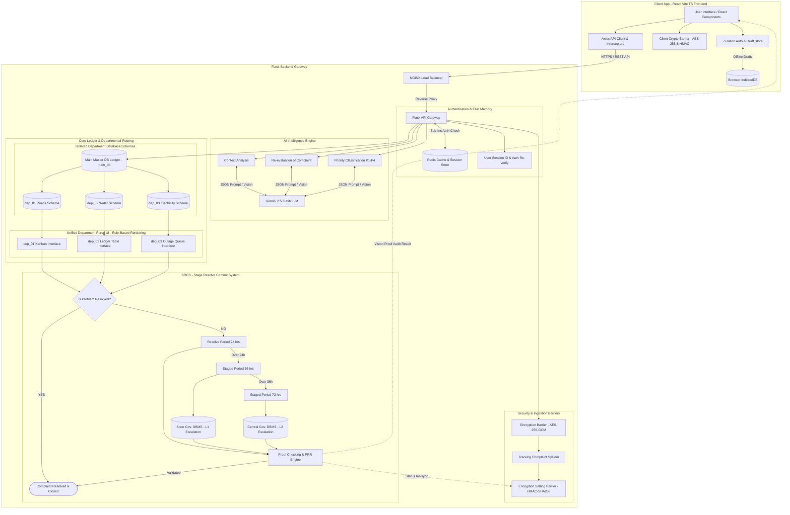

# Product Requirement Document (PRD.md) — SIH 02 Complaint Resolution System

## 1. Executive Summary & Vision
The **SIH 02 Complaint Resolution System** is an enterprise-grade, AI-driven public grievance and complaint resolution platform built using a **React + Vite + TypeScript Frontend** and a **Python Flask Backend**. The system automates grievance intake, performs intelligent context and priority analysis using **Gemini 2.5 Flash LLM**, isolates departmental workflows (`dep_01`, `dep_02`, `dep_03`), and enforces strict resolution timelines through a novel **SRCS (Stage Resolve Commit System)**.

By leveraging **NGINX Load Balancing**, **Redis In-Memory Caching**, dual-layer **Encryption & Salting Barriers**, and multi-tier government database escalation (**State Gov. DBMS** & **Central Gov. DBMS**), the platform guarantees zero downtime, sub-millisecond session authentication, and transparent SLA enforcement.

---

## 2. Master System Architecture Topology

Every requirement, API module, and frontend UI component in this document maps directly to the system architecture topology below:

---

## 3. Target Audience & Core Use Cases
- **Citizens (Complainants)**: Submit complaints via React web UI, receive instant AI-classified priority, and track status in real-time via Redis-cached lookups without hitting `main_db`. If offline, drafts are saved locally in **IndexedDB**.
- **Departmental Officers (`dep_01`, `dep_02`, `dep_03`)**: View routed complaints in isolated department tables / Kanban boards, submit resolution proofs via PRR Studio, and update statuses.
- **System Administrators & Auditors**: Monitor SLA breach timelines (24h/36h/72h), oversee automatic escalation to State Gov. DBMS (L1) and Central Gov. DBMS (L2), view Leaflet heatmaps & Recharts analytics, and run PRR (Problem Resolve Re-evaluation) verifications.

---

## 4. Key Feature Specifications & API Endpoints

### 4.1 Ingestion & Authentication API
- **`POST /api/v1/auth/verify`**: Validates citizen session token via **Redis Session Store** (sub-millisecond response).
- **`POST /api/v1/auth/reverify`**: Requires password/OTP re-verification before critical SRCS state changes (handled in UI via Re-Auth Modal).
- **`POST /api/v1/complaints/submit`**: Encrypts payload via **Encryption Barrier** (AES-256-GCM), assigns tracking hash salted via **Encryption Salting Barrier**, and pushes to pipeline.

### 4.2 AI Context & Priority Engine (`/api/v1/ai/...`)
- **`POST /api/v1/ai/analyze-context`**: Calls **Gemini 2.5 Flash LLM** to extract semantic keywords, category, and urgency score.
- **`POST /api/v1/ai/classify-priority`**: Automatically assigns priority (`P1-CRITICAL`, `P2-HIGH`, `P3-MEDIUM`, `P4-LOW`) based on Gemini analysis.

### 4.3 Routing & Departmental Interfaces
- **`GET /api/v1/departments/<dep_id>/complaints`**: Fetches department-specific complaints from isolated `dep_01`, `dep_02`, or `dep_03` SQL tables.
- **`PUT /api/v1/departments/<dep_id>/resolve`**: Officer submits resolution details + image/pdf proof.

### 4.4 SRCS (Stage Resolve Commit System) Engine
- **`POST /api/v1/srcs/check-sla`**: Celery background task evaluating 24h, 36h, and 72h SLA boundaries.
- **`POST /api/v1/srcs/escalate`**: Triggers **State Gov. DBMS (L1)** persistence at 36h breach and **Central Gov. DBMS (L2)** persistence at 72h breach.
- **`POST /api/v1/srcs/prr-verify`**: Runs **PRR (Problem Resolve Re-evaluation)** using Gemini 2.5 Flash vision/text context match against submitted resolution proof (rendered in UI via `PRRStudio.tsx`).

---

## 5. Non-Functional Requirements (NFRs)
- **Performance**: Response time < 50ms for cached status queries via Redis; < 1.2s for Gemini LLM context classification.
- **Frontend Responsiveness**: Fast SPA page loads (< 1.5s) powered by Vite, Tailwind CSS, and TanStack Query.
- **Scalability**: NGINX load balancer distributing requests across Gunicorn Flask workers.
- **Data Security**: Client & Server AES-256 encryption at rest/in transit; salting barrier for hash verification.
- **Availability**: 99.9% uptime guaranteed via decoupled worker architecture and offline IndexedDB draft storage.
