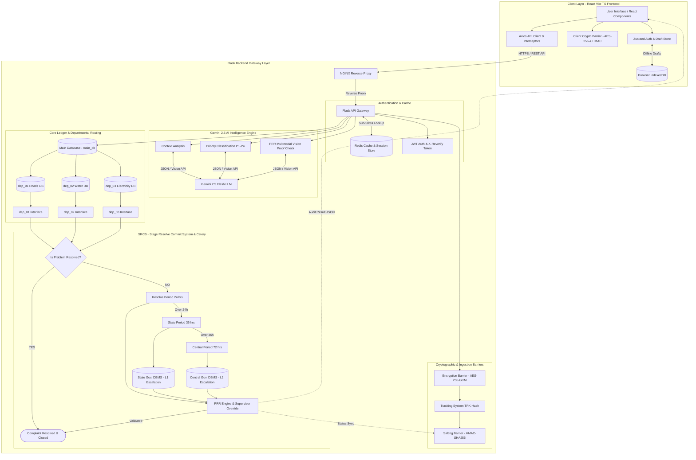
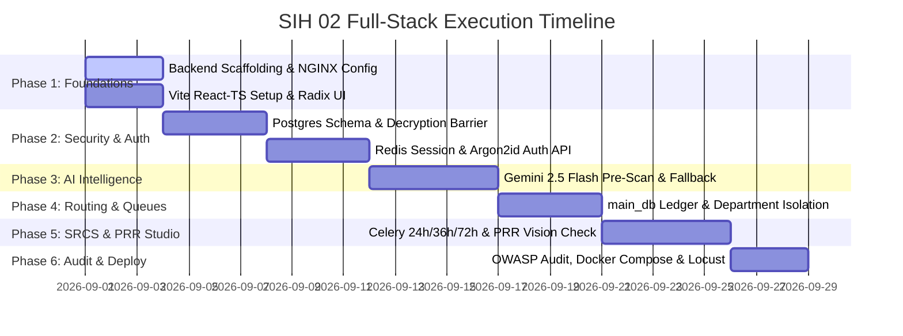

# Project Development Roadmap & Full-Stack Execution Phases (Phases.md)

## 1. Master System Architecture & Flow Topology

---

## 2. Development Timeline Gantt Chart

---

## 3. Detailed Phase Breakdown & Task Ownership

### Phase 1: Environment Scaffolding, Vite Setup & Gateway Routing
* **Backend Developer Deliverables**:
  * Setup Python 3.11 virtual environment with Flask 3.x Application Factory pattern (`src/app/__init__.py`).
  * Configure NGINX reverse proxy (`nginx.conf`) with SSL termination and rate-limiting blocks.
  * Setup initial CORS middleware and environment configuration (`.env`).
* **Frontend Developer Deliverables**:
  * Initialize Vite + React 18 + TypeScript repository with Tailwind CSS, Zustand, and TanStack Query.
  * Setup Radix UI components (Dialog, Tabs, Toast, Tooltip, Progress, Accordion) and Lucide React icons.
  * Configure Axios base client with default timeout (10,000ms).
* **Milestone Exit Criteria**: NGINX successfully proxies local requests to Flask `/health` and Vite dev server renders initial UI shell.

---

### Phase 2: Security Barriers, Authentication & State Persistence
* **Backend Developer Deliverables**:
  * Implement **Decryption Barrier**: AES-256-GCM decryption service for incoming client payloads.
  * Implement **Salting Barrier**: HMAC-SHA256 signature verification to ensure zero tampering.
  * Build Argon2id officer password hashing helper (`argon2-cffi`).
  * Implement Auth Endpoints:
    * `POST /api/v1/auth/otp/send`: Generates 6-digit OTP stored in Redis (300s TTL).
    * `POST /api/v1/auth/otp/verify`: Verifies OTP and returns Citizen JWT Token.
    * `POST /api/v1/auth/officer/login`: Authenticates officer credentials and returns scoped JWT.
    * `POST /api/v1/auth/reverify`: Generates `X-Reverify-Token` for sensitive actions.
* **Frontend Developer Deliverables**:
  * Implement Client Crypto Barrier (`src/lib/crypto.ts`) using Web Crypto API (`AES-GCM` + `HMAC-SHA256`).
  * Build Axios response interceptors for `401 Unauthorized` (saving draft to `DraftStore` and launching Re-Auth Modal) and `403 Forbidden` (`X-Reverify-Token` modal).
  * Build `429 Rate Limit` interceptor with exponential backoff ($1\text{s} \to 2\text{s} \to 4\text{s}$).
  * Configure `navigator.onLine` listener and IndexedDB offline draft storage.
* **Milestone Exit Criteria**: Citizen and Officer auth flows pass JWT verification; encrypted payloads are decrypted cleanly on Flask backend.

---

### Phase 3: Gemini 2.5 Flash AI Engine & Classification Gateway
* **Backend Developer Deliverables**:
  * Integrate Google GenAI SDK with `gemini-2.5-flash` model using free tier API key.
  * Build `POST /api/v1/ai/pre-analyze` endpoint:
    * Extracts category, urgency score (1 to 10), priority level (`P1-CRITICAL` to `P4-LOW`), and target department (`dep_01`, `dep_02`, `dep_03`).
  * Implement sub-2.0s timeout with deterministic rule-based keyword fallback.
* **Frontend Developer Deliverables**:
  * Build Step 3 of Complaint Wizard featuring live AI analysis preview card.
  * Render urgency score badge, estimated SLA window, and duplicate complaint warnings.
* **Milestone Exit Criteria**: Raw complaint text/voice input returns valid structured JSON within 2.0 seconds or falls back to rule parser cleanly.

---

### Phase 4: Departmental Routing, Schema Isolation & Queue Ledgers
* **Backend Developer Deliverables**:
  * Design PostgreSQL `main_db` schema (`complaints`, `users`, `audit_logs`).
  * Create isolated sub-department schemas (`dep_01_schema` Roads, `dep_02_schema` Water, `dep_03_schema` Electricity).
  * Implement `POST /api/v1/complaints/submit`: Saves complaint to `main_db` and pushes tracking object to Redis cache (`tracking:<hash>`, 300s TTL).
  * Implement `GET /api/v1/complaints/track/:tracking_hash`: Sub-50ms Redis lookup (`X-Cache: HIT`) with PostgreSQL fallback.
  * Implement `GET /api/v1/departments/:dep/complaints`: Department-scoped queue endpoint.
* **Frontend Developer Deliverables**:
  * Build Department Triage Dashboards (`/officer/dep_01`, `dep_02`, `dep_03`).
  * Implement `DepartmentKanban.tsx` with optimistic drag-and-drop state updates and automatic server rollback on HTTP failure.
  * Build `ComplaintTimeline.tsx` real-time tracking barometer hook (`useTrackStatus`).
* **Milestone Exit Criteria**: Complaints lodge under 50ms lookup speed via Redis, and officer queues strictly enforce department isolation.

---

### Phase 5: SRCS Multi-Stage Escalation & Gemini PRR Studio Integration
* **Backend Developer Deliverables**:
  * Build Celery background scheduler for continuous SLA tracking:
    * **24 Hours**: Stage 1 departmental resolution tracking.
    * **36 Hours (L1 State DBMS)**: Automatically update status to `STAGE_36H_STATE` and sync record to State Gov DBMS table.
    * **72 Hours (L2 Central DBMS)**: Automatically update status to `STAGE_72H_CENTRAL` and sync record to Central Gov DBMS table.
  * Build PRR Verification Endpoints:
    * `POST /api/v1/srcs/submit-proof`: Upload resolution proof photo.
    * `POST /api/v1/srcs/prr-verify`: Invokes Gemini 2.5 Flash Vision to audit original photo vs proof photo.
    * `POST /api/v1/srcs/commit-resolution`: Requires supervisor digital signature if confidence score $< 70\%$.
* **Frontend Developer Deliverables**:
  * Build `PRRStudio.tsx` side-by-side visual audit workspace with confidence score display.
  * Build `SlaCountdown.tsx` component with dynamic badge escalation warnings.
  * Build SRCS Analytics Dashboard (`/srcs/analytics`) featuring Recharts charts and Leaflet heatmaps.
* **Milestone Exit Criteria**: SLA breach tasks execute automatically on schedule, and PRR Studio blocks proof acceptance when AI confidence is low.

---

### Phase 6: Security Audit, Load Testing & Production Deployment
* **Backend & Frontend Joint Deliverables**:
  * Run OWASP dependency vulnerability audit and fix high/critical CVEs.
  * Execute Locust load testing script verifying NGINX + Redis concurrency under peak complaint spikes.
  * Verify 100% free-tier stack compliance (Gemini 2.5 Flash Free API, Redis, PostgreSQL).
  * Assemble multi-stage `docker-compose.yml` manifest.
* **Milestone Exit Criteria**: Full-stack application builds cleanly, passes security audit, and runs via Docker Compose with zero cost overhead.
