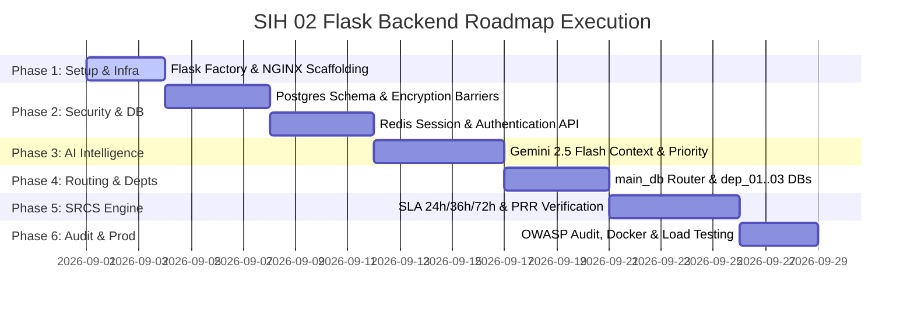

# Project Development Roadmap & Phases (Phases.md) — Flask Backend

## 1. Roadmap Overview & Timeline

---

## Phase 1: Environment Scaffolding & NGINX Setup
- Initialize Python 3.11 virtual environment & Flask 3.x Application Factory pattern.
- Configure NGINX reverse proxy, SSL termination, and rate-limiting limits.
- Set up Docker Compose for local development (Flask, PostgreSQL, Redis).

## Phase 2: Security Barriers & Authentication Engine
- Build **Encryption Barrier** (AES-256-GCM) and **Encryption Salting Barrier** (HMAC-SHA256).
- Implement Redis Session Store middleware and Argon2id user password hashing.
- Build `/api/v1/auth/login`, `/api/v1/auth/verify`, and `/api/v1/auth/reverify` endpoints.

## Phase 3: Gemini 2.5 Flash AI Engine Integration
- Configure Google GenAI SDK with `gemini-2.5-flash` model.
- Implement structured JSON prompt engineering for **Context Analysis** and **Priority Classification** (`P1` to `P4`).
- Add fallback keyword classifier for API timeout resilience.

## Phase 4: Departmental Routing & Schema Isolation
- Create `main_db` master complaint ledger and isolated schemas (`dep_01_schema`, `dep_02_schema`, `dep_03_schema`).
- Implement Flask Blueprints for department interfaces (`/api/v1/departments/<dep_id>/...`).

## Phase 5: SRCS (Stage Resolve Commit System) & PRR Engine
- Build Celery background worker for SLA monitoring (24h alert, 36h State DBMS sync, 72h Central DBMS sync).
- Implement PRR (Problem Resolve Re-evaluation) Vision proof matching with Gemini Flash multi-modal input.

## Phase 6: Security Audit, Dockerization & Production Verification
- Execute OWASP security vulnerability audit.
- Run load testing using Locust / Apache Bench (verifying NGINX + Redis concurrency).
- Finalize production Docker Compose and deployment manifests.
