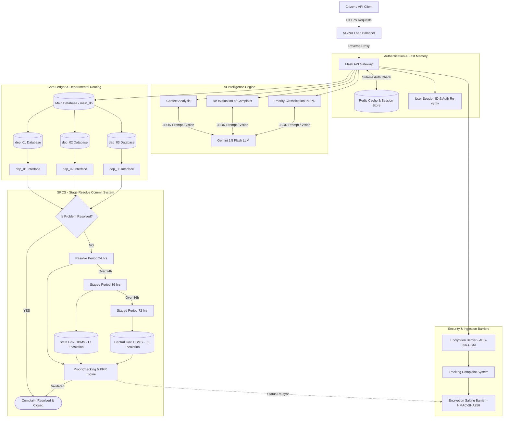

# System Rules & Guidelines (Rules.md) — Flask Backend

## 1. Core Architectural Principles
1. **Explicit Architecture Mapping**: Every developer edit MUST map to a component in the master architecture topology (NGINX, Redis, Encryption Barrier, Salting Barrier, Gemini LLM, `main_db`, `dep_01..03`, or SRCS).
2. **Defensive AI Prompting**: All Gemini 2.5 Flash prompts MUST enforce strict JSON schemas (`response_mime_type="application/json"`) with deterministic low temperature (`0.1`).
3. **Zero-Trust Data Protection**: All sensitive citizen grievance data MUST pass through the **Encryption Barrier** (AES-256-GCM) before DB persistence, and all lookup hashes MUST pass through the **Salting Barrier** (HMAC-SHA256).
4. **Mandatory Runtime Verification**: Never declare an API endpoint or SRCS feature complete without running automated test suites or CURL verification.

---

## 2. System Architecture Reference



---

## 3. Implementation Rules: What to Do vs. What to Avoid

### REQUIRED (Do This)
- **Flask Application Factory**: Use `create_app()` factory pattern with modular Flask Blueprints (`auth_bp`, `complaints_bp`, `ai_bp`, `departments_bp`, `srcs_bp`).
- **SQLAlchemy 2.0 Syntax**: Use explicit `db.session.execute(select(...))` and `db.session.commit()`.
- **Redis Caching Decorator**: Wrap all citizen lookup routes with Redis cache check to guarantee sub-50ms response times.
- **Structured Error Responses**: Always return standard JSON error schemas:
  ```json
  {
    "error": "ErrorCategory",
    "message": "Human readable detail",
    "status_code": 400
  }
  ```

---

### STRICTLY FORBIDDEN (Avoid This)
- **DO NOT** write raw SQL query strings with string concatenation (`f"SELECT * FROM users WHERE id='{user_id}'"`). Always use SQLAlchemy ORM parameterization.
- **DO NOT** execute blocking LLM or HTTP calls on the main Flask request loop. Use Celery background tasks for long operations.
- **DO NOT** store unencrypted plain text passwords or secrets in codebase / git repos. Use `.env` with environment variable validation.
- **DO NOT** allow officers to close complaints without passing through the **SRCS PRR Engine** proof checking.

---

## 4. Recommended Code Template: Flask Blueprint (`app/api/complaints.py`)

```python
from flask import Blueprint, request, jsonify, g
from app.api.auth import require_session
from app.services.encryption_service import EncryptionBarrierService, EncryptionSaltingBarrierService
from app.services.gemini_service import GeminiFlashEngine
from app.extensions import db, redis_client
from app.models.complaint import Complaint
import os

complaints_bp = Blueprint("complaints", __name__, url_prefix="/api/v1/complaints")

enc_service = EncryptionBarrierService(os.getenv("MASTER_ENCRYPTION_KEY_B64"))
salt_service = EncryptionSaltingBarrierService(os.getenv("SALT_SECRET"))
gemini_engine = GeminiFlashEngine(os.getenv("GEMINI_API_KEY"))

@complaints_bp.route("/submit", methods=["POST"])
@require_session
def submit_complaint():
    data = request.get_json()
    raw_text = data.get("text")
    if not raw_text:
        return jsonify({"error": "ValidationError", "message": "Complaint text required"}), 400

    # 1. AI Context & Priority Classification via Gemini 2.5 Flash
    ai_result = gemini_engine.analyze_and_classify(raw_text)

    # 2. Encrypt sensitive text via Encryption Barrier
    encrypted_text = enc_service.encrypt_payload(raw_text)

    # 3. Create Complaint Model
    complaint = Complaint(
        user_id=g.current_user["user_id"],
        encrypted_data=encrypted_text,
        category=ai_result["category"],
        priority=ai_result["priority_level"],
        summary=ai_result["summary"],
        department=ai_result["target_department"]
    )
    db.session.add(complaint)
    db.session.commit()

    # 4. Generate Salted Tracking Hash & Cache in Redis
    tracking_hash = salt_service.generate_salted_tracking_hash(str(complaint.id), str(complaint.created_at))
    complaint.tracking_hash = tracking_hash
    db.session.commit()

    # Cache status in Redis
    redis_client.setex(f"trk:{tracking_hash}", 3600, jsonify({
        "tracking_hash": tracking_hash,
        "status": "INGESTED",
        "priority": ai_result["priority_level"],
        "department": ai_result["target_department"]
    }).get_data(as_text=True))

    return jsonify({
        "success": True,
        "complaint_id": str(complaint.id),
        "tracking_hash": tracking_hash,
        "priority": ai_result["priority_level"],
        "department": ai_result["target_department"]
    }), 201
```
