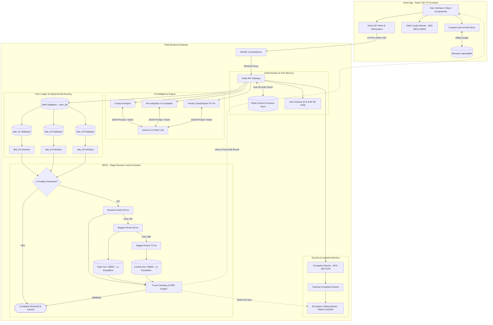

# System Rules & Guidelines (Rules.md) — Full-Stack

## 1. Core Architectural Principles
1. **Explicit Architecture Mapping**: Every developer edit MUST map to a component in the master architecture topology (React UI, NGINX, Redis, Encryption Barrier, Salting Barrier, Gemini LLM, `main_db`, `dep_01..03`, or SRCS).
2. **Defensive AI Prompting**: All Gemini 2.5 Flash prompts MUST enforce strict JSON schemas (`response_mime_type="application/json"`) with deterministic low temperature (`0.1`).
3. **Zero-Trust Data Protection**: All sensitive citizen grievance data MUST pass through the **Encryption Barrier** (AES-256-GCM) before DB persistence, and all lookup hashes MUST pass through the **Salting Barrier** (HMAC-SHA256).
4. **Mandatory Runtime Verification**: Never declare an API endpoint or UI feature complete without running automated test suites or CURL verification.

---

## 2. System Architecture Reference

---

## 3. Implementation Rules: What to Do vs. What to Avoid

### REQUIRED (Do This)
- **Flask Application Factory**: Use `create_app()` factory pattern with modular Flask Feature Blueprints (`app/features/*`).
- **SQLAlchemy 2.0 Syntax**: Use explicit `db.session.execute(select(...))` and `db.session.commit()`.
- **Redis Caching Decorator**: Wrap all citizen lookup routes with Redis cache check to guarantee sub-50ms response times.
- **Frontend Interceptor & Re-Auth Modal**: Capture `401`/`403` responses in Axios interceptors and launch Re-Auth Modal without losing user form draft.

---

### STRICTLY FORBIDDEN (Avoid This)
- **DO NOT** write raw SQL query strings with string concatenation (`f"SELECT * FROM users WHERE id='{user_id}'"`). Always use SQLAlchemy ORM parameterization.
- **DO NOT** execute blocking LLM or HTTP calls on the main Flask request loop. Use Celery background tasks for long operations.
- **DO NOT** store unencrypted plain text passwords or secrets in codebase / git repos. Use `.env` with environment variable validation.
- **DO NOT** allow officers to close complaints without passing through the **SRCS PRR Engine** proof checking in `PRRStudio.tsx`.
