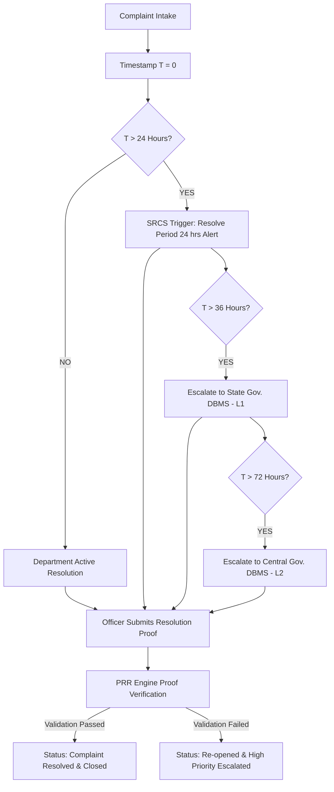

# Security Audits, SLA Compliance & Verification Rules (Security_audits.md) — Flask Backend

## 1. Executive Summary
This document defines the security audit standards, OWASP compliance rules, and audit verification protocols for the **SIH 02 Complaint Resolution System**.

Special focus is given to auditing the **SRCS (Stage Resolve Commit System)** SLA transitions (24h/36h/72h) and verifying resolution proofs via the **PRR (Problem Resolve Re-evaluation) Engine**.

---

## 2. OWASP Top 10 Flask Mitigation Matrix

| Vulnerability | Threat Description | Flask Backend Mitigation |
| :--- | :--- | :--- |
| **A01: Broken Access Control** | Unauthorized access to department endpoints (`dep_01..03`) | Role-Based Access Control (RBAC) middleware verifying session role claims in Redis |
| **A02: Cryptographic Failures** | Plaintext transmission of citizen grievances | Mandatory SSL/TLS 1.3, AES-256-GCM Encryption Barrier, and HMAC-SHA256 Salting Barrier |
| **A03: Injection** | SQL Injection via raw query parameters | Mandatory SQLAlchemy 2.0 ORM parameterization; zero raw SQL strings |
| **A04: Insecure Design** | Premature or fake complaint resolution by officers | **SRCS PRR Engine**: Mandatory proof checking with Gemini 2.5 Flash vision/text context match |
| **A05: Security Misconfiguration** | Exposed debug modes, default secret keys | Environment variables validated at boot via Pydantic/Flask config schema |
| **A07: Identification Failures** | Brute force session hijacking | Redis Sliding Window Rate Limiting (max 60 req/min per IP, 5 login attempts/min) |

---

## 3. SRCS SLA Audit & Escalation Rules



---

## 4. PRR Engine Audit Verification Service (`app/services/srcs_service.py`)

```python
from datetime import datetime, timezone
from app.models.complaint import Complaint
from app.extensions import db, redis_client

class SRCSAuditEngine:
    @staticmethod
    def audit_complaint_sla(complaint_id: str):
        """Evaluates SLA boundary timestamps and triggers automated governance escalation."""
        complaint = Complaint.query.get(complaint_id)
        if not complaint or complaint.status == "RESOLVED":
            return
        
        now = datetime.now(timezone.utc)
        elapsed_hours = (now - complaint.created_at).total_seconds() / 3600.0

        if elapsed_hours >= 72 and complaint.srcs_stage != "ESCALATED_CENTRAL":
            complaint.srcs_stage = "ESCALATED_CENTRAL"
            complaint.escalated_central_at = now
            # Trigger persistence to Central Gov. DBMS
            db.session.commit()
            redis_client.publish("srcs_alerts", f"CENTRAL_ESCALATION:{complaint_id}")

        elif elapsed_hours >= 36 and complaint.srcs_stage not in ["ESCALATED_STATE", "ESCALATED_CENTRAL"]:
            complaint.srcs_stage = "ESCALATED_STATE"
            complaint.escalated_state_at = now
            # Trigger persistence to State Gov. DBMS
            db.session.commit()
            redis_client.publish("srcs_alerts", f"STATE_ESCALATION:{complaint_id}")

        elif elapsed_hours >= 24 and complaint.srcs_stage == "NORMAL":
            complaint.srcs_stage = "SLA_24H_BREACH"
            db.session.commit()
```

---

## 5. Security Logging & Audit Trail Standards

Every security-sensitive event (login, token re-verification, encryption barrier access, department routing, SRCS SLA escalation) must produce an **immutable audit log entry**:

```json
{
  "timestamp": "2026-09-03T15:18:30Z",
  "event_type": "SRCS_SLA_ESCALATION",
  "complaint_id": "c7a8e912-3b4f-4d1a-8e99-123456789abc",
  "department_id": "dep_01",
  "elapsed_hours": 36.5,
  "action_taken": "ESCALATED_TO_STATE_GOV_DBMS",
  "hash_signature": "e3b0c44298fc1c149afbf4c8996fb92427ae41e4649b934ca495991b7852b855",
  "client_ip": "10.0.4.12"
}
```
