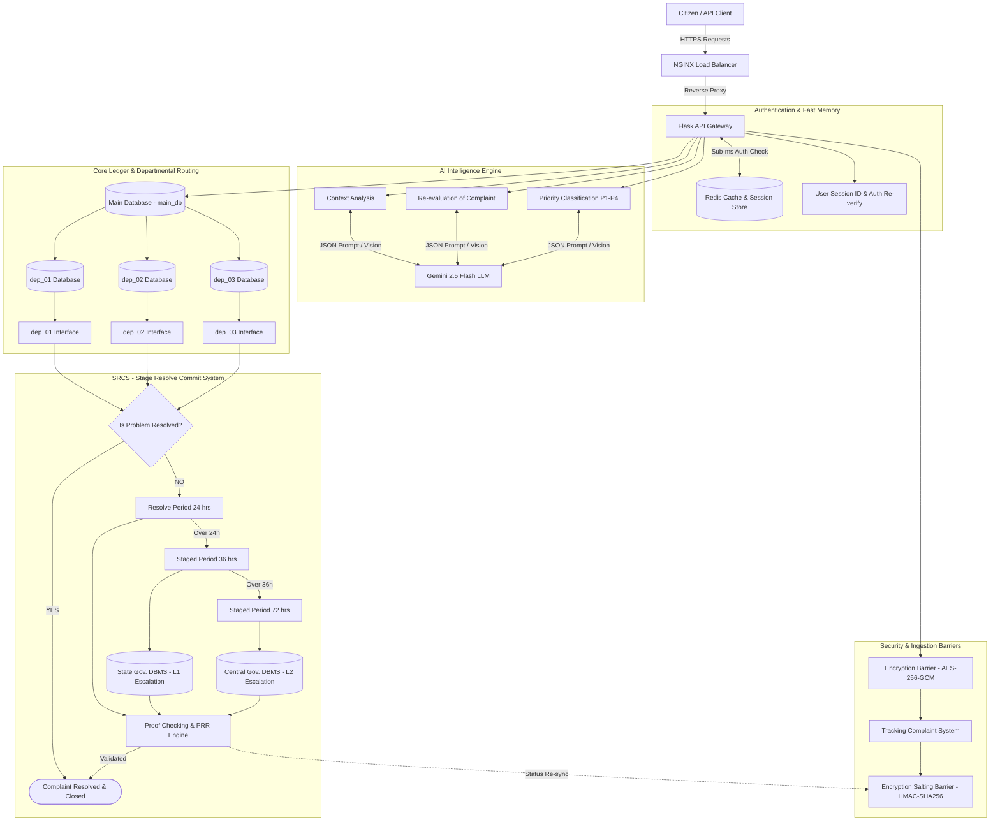

# Database Security & Data Privacy Strategy (Security_db.md) — Flask Backend

## 1. Executive Summary
This document specifies the database security, encryption protocols, and multi-tenant schema isolation architecture for the **SIH 02 Complaint Resolution System**. 

The database architecture employs **dual-layer cryptographic barriers**:
1. **Encryption Barrier**: AES-256-GCM symmetric encryption for sensitive citizen complaint text and attachments in transit and at rest.
2. **Encryption Salting Barrier**: HMAC-SHA256 salted hashing for complaint tracking IDs and verification lookup tokens.

---

## 2. Security Architecture Placement

The Encryption Barrier, Salting Barrier, main_db, isolated departmental schemas (`dep_01..03`), and external State/Central DBMS fit into the master architecture as shown:



---

## 3. Implementation Specifications: Dual Barrier Services

### 3.1 Encryption Barrier Service (`app/services/encryption_service.py`)

```python
import os
import base64
from cryptography.hazmat.primitives.ciphers.aead import AESGCM

class EncryptionBarrierService:
    def __init__(self, master_key_b64: str):
        self.key = base64.b64decode(master_key_b64)
        self.aesgcm = AESGCM(self.key)

    def encrypt_payload(self, plain_text: str) -> str:
        """Encrypts sensitive complaint text using AES-256-GCM with a 96-bit nonce."""
        nonce = os.urandom(12)
        ciphertext = self.aesgcm.encrypt(nonce, plain_text.encode("utf-8"), None)
        packed = nonce + ciphertext
        return base64.b64encode(packed).decode("utf-8")

    def decrypt_payload(self, encrypted_b64: str) -> str:
        """Decrypts AES-256-GCM ciphertext payload."""
        packed = base64.b64decode(encrypted_b64.encode("utf-8"))
        nonce = packed[:12]
        ciphertext = packed[12:]
        decrypted_bytes = self.aesgcm.decrypt(nonce, ciphertext, None)
        return decrypted_bytes.decode("utf-8")
```

### 3.2 Encryption Salting Barrier Service

```python
import hmac
import hashlib

class EncryptionSaltingBarrierService:
    def __init__(self, salt_secret: str):
        self.salt_secret = salt_secret.encode("utf-8")

    def generate_salted_tracking_hash(self, complaint_id: str, timestamp: str) -> str:
        """Generates a tamper-proof HMAC-SHA256 salted hash for complaint tracking lookups."""
        message = f"{complaint_id}:{timestamp}".encode("utf-8")
        signature = hmac.new(self.salt_secret, message, hashlib.sha256).hexdigest()
        return f"TRK-{signature[:16].upper()}"
```

---

## 4. Multi-Tenant Departmental DB Isolation (`dep_01`, `dep_02`, `dep_03`)

To guarantee strict data security between different government sectors (e.g. Roads/Infrastructure, Water Supply, Electricity), the system enforces **PostgreSQL Schema Isolation**:

```sql
-- Schema creation for isolated department databases
CREATE SCHEMA IF NOT EXISTS dep_01_schema;
CREATE SCHEMA IF NOT EXISTS dep_02_schema;
CREATE SCHEMA IF NOT EXISTS dep_03_schema;

-- Isolated Complaint Table for Department 01
CREATE TABLE dep_01_schema.complaints (
    id UUID PRIMARY KEY DEFAULT gen_random_uuid(),
    master_complaint_id UUID NOT NULL,
    encrypted_details TEXT NOT NULL,
    priority_level VARCHAR(20) NOT NULL,
    status VARCHAR(30) DEFAULT 'PENDING_RESOLVE',
    assigned_officer_id UUID,
    created_at TIMESTAMP WITH TIME ZONE DEFAULT CURRENT_TIMESTAMP,
    updated_at TIMESTAMP WITH TIME ZONE DEFAULT CURRENT_TIMESTAMP
);
```

---

## 5. External Escalation DBMS Persistence (State & Central DBMS)

When complaints breach the 36h or 72h SLA boundaries within the **SRCS (Stage Resolve Commit System)**, the system persists audit records to State and Central Government databases:

| Escalation Tier | SLA Boundary | Target DBMS | Security Protocol |
| :--- | :--- | :--- | :--- |
| **Level 1 Escalation** | > 36 Hours | `State Gov. DBMS` | TLS 1.3 + Client Certificate (mTLS) + HMAC Audit Signature |
| **Level 2 Escalation** | > 72 Hours | `Central Gov. DBMS` | TLS 1.3 + mTLS + Immutable Append-Only Ledger Transaction |
