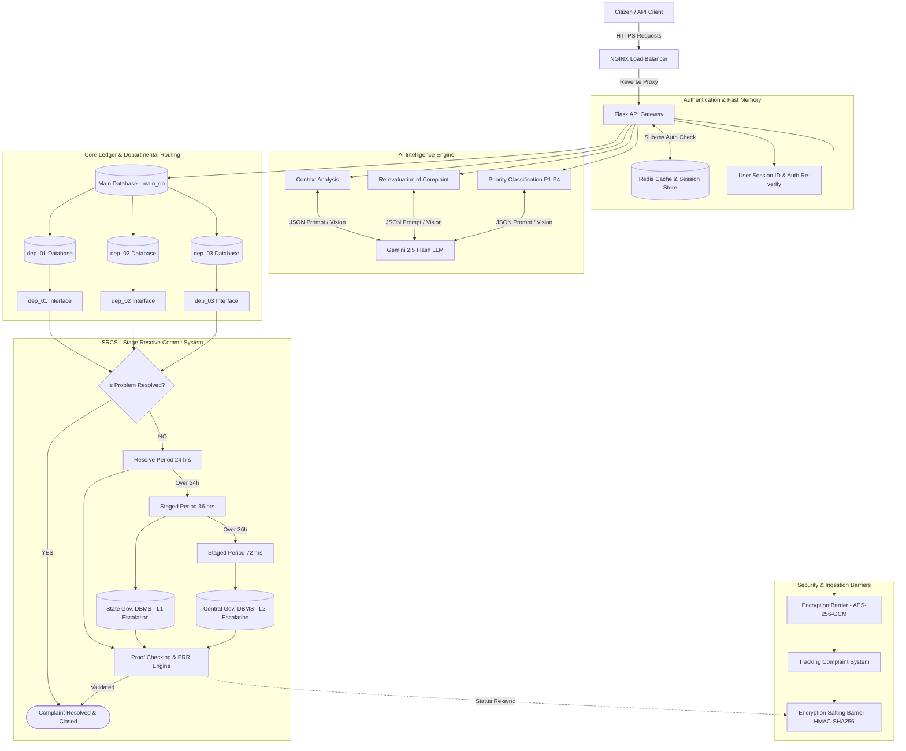

# AI Skill & System Prompt Specification (Skill.md) — Gemini 2.5 Flash LLM

## 1. Executive Summary
This document specifies the prompt engineering strategies, system instructions, and structured JSON output schemas for integrating **Gemini 2.5 Flash LLM** into the **SIH 02 Complaint Resolution System**.

Gemini 2.5 Flash powers three critical intelligence modules:
1. **Context Analysis Engine**: Semantic intent extraction and automated tagging.
2. **Priority Classification Engine**: Urgency scoring (`P1-CRITICAL` to `P4-LOW`).
3. **PRR (Problem Resolve Re-evaluation) Engine**: Multi-modal vision and text context verification for resolution proof checking.

---

## 2. AI Intelligence Engine in System Architecture

The Gemini 2.5 Flash LLM connects directly to Flask API, `main_db`, Redis cache, and the SRCS PRR Engine as shown below:



---

## 3. Gemini 2.5 Flash Service Integration (`app/services/gemini_service.py`)

```python
import json
import google.generativeai as genai

class GeminiFlashEngine:
    def __init__(self, api_key: str):
        genai.configure(api_key=api_key)
        self.model = genai.GenerativeModel(
            model_name="gemini-2.5-flash",
            generation_config={"temperature": 0.1, "response_mime_type": "application/json"}
        )

    def analyze_and_classify(self, complaint_text: str) -> dict:
        """Executes combined context extraction and priority classification."""
        prompt = f"""
You are the AI Intelligence Engine for the SIH 02 Public Grievance Platform.
Analyze the following citizen complaint text and respond strictly in JSON.

Complaint Text:
"{complaint_text}"

Return JSON matching this schema:
{{
  "category": "ROADS_INFRASTRUCTURE | WATER_SUPPLY | ELECTRICITY | SANITATION | OTHER",
  "keywords": ["list", "of", "semantic", "keywords"],
  "urgency_score": <integer from 1 to 10>,
  "priority_level": "P1-CRITICAL | P2-HIGH | P3-MEDIUM | P4-LOW",
  "summary": "<1-sentence neutral summary>",
  "target_department": "dep_01 | dep_02 | dep_03"
}}
"""
        response = self.model.generate_content(prompt)
        return json.loads(response.text)
```

---

## 4. PRR (Problem Resolve Re-evaluation) Vision Proof Matcher

When an officer submits resolution proof (e.g. photo of fixed road/pipe), the PRR Engine compares original complaint context with submitted proof:

```python
    def verify_resolution_proof(self, complaint_summary: str, image_bytes: bytes, mime_type: str = "image/jpeg") -> dict:
        """Uses Gemini 2.5 Flash Vision capability to audit resolution proof."""
        image_part = {"mime_type": mime_type, "data": image_bytes}
        
        prompt = f"""
You are the SRCS PRR (Problem Resolve Re-evaluation) Auditor.
Original Complaint Summary: "{complaint_summary}"

Inspect the provided resolution proof image and evaluate whether it genuinely demonstrates that the reported issue has been resolved.

Return JSON matching this schema:
{{
  "is_valid_proof": <boolean true/false>,
  "confidence_score": <float between 0.0 and 1.0>,
  "visual_evidence_observed": "<description of visual proof>",
  "audit_decision": "PASS | REJECT_INSUFFICIENT_PROOF | REJECT_MISMATCH",
  "reasoning": "<explanation for the decision>"
}}
"""
        response = self.model.generate_content([prompt, image_part])
        return json.loads(response.text)
```

---

## 5. Prompt Engineering Rules & Guardrails

1. **Deterministic Output (`temperature = 0.1`)**: Ensures consistent classification across runs for identical complaint text.
2. **Strict JSON Schema (`response_mime_type = "application/json"`)**: Guaranteed JSON parsing without regex trimming.
3. **Safety Filters**: Block offensive text while extracting core grievance intent without failing request.
4. **Fallback Handling**: If Gemini API call times out (> 2.0s), default to fallback heuristic keyword matching (`dep_01` = Roads, `dep_02` = Water, `dep_03` = Electricity) with priority `P3-MEDIUM`.
